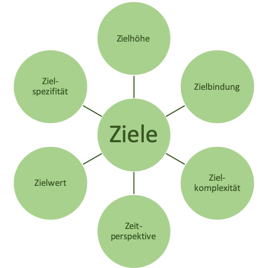
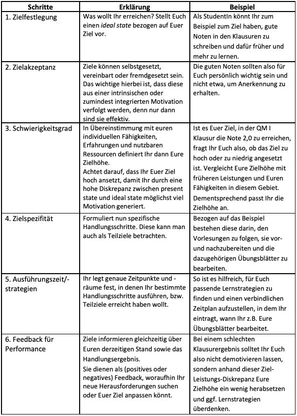

Eine Klausur bestehen, neue Freunde finden, überflüssige Pfunde loswerden, unseren Traumberuf ausüben – wir alle haben Ziele. Und das auch zu Recht: Studien haben gezeigt, dass allgemein Menschen mit Zielen bei einer Aufgabe die Leistung derer ohne Ziel übertreffen. Oft fällt es uns aber schwerer als gedacht unsere Ziele umzusetzen und die zu Beginn sehr hohe Motivation flacht ab bis man frustriert wieder in alte Handlungsmuster zurückfällt.
So stellt sich die berechtigte Frage: Wie können wir unsere Zielsetzung so gestalten, dass wir unsere Ziele erfolgreich erreichen?

Ziele sind psychologisch definiert als die Vorwegnahme von Handlungsfolgen und orientieren sich an zukünftigen, angestrebten Handlungsergebnissen. 
Sie leiten und fokussieren unser Handeln, sodass wir bessere Leistung erbringen und motivierter sind. Stellen wir also eine Diskrepanz zwischen unserem present state (momentaner Zustand) und unserem ideal state (erwünschter Zustand) fest, dann generiert diese Uneinigkeit Motivation, Ziele zu setzen und so den present state in die gewünschte Richtung zu verändern.

Dabei definieren verschiedene Eigenschaften unsere Ziele (s. Abb. 1). Die Ausprägung dieser hat einen wichtigen Einfluss auf den Erfolg bei der jeweiligen Zielerreichung. Allgemein gilt, für eine möglichst hohe Erfolgswahrscheinlichkeit, sollte das Ziel relativ schwierig und sehr spezifisch formuliert sein. 
 
## *Abbildung 1*   

  

In einer von uns durchgeführten Onlineumfrage haben 100 TeilnehmerInnen aus verschieden Lebenssituationen, wobei über die Hälfte Studierende waren, Fragen zu ihrer persönlichen Zielsetzung beantwortet: Tatsächlich verfolgt fast jede/r Befragte ein spezielles persönliches Ziel; der Fokus liegt hier bei fast 70% auf dem Bereich Studium/Arbeit (s. Abb. 2). 80% der Teilnehmer planen nur ungefähr, wie sie vorgehen, um ihr Ziel zu erreichen, ohne sich genaue Handlungsschritte zu überlegen. Es zeigte sich außerdem, dass fast die Hälfte, ihre Ziele schnell aus den Augen verlieren. Eines der Hauptprobleme bei der Zielerreichung ist, dass sich die TeilnehmerInnen ihre Ziele zu hoch ansetzen (s. Abb. 3). 
Diese Ergebnisse verdeutlichen, dass es wichtig ist, bei mehreren zeitgleichen Zielen zu priorisieren, und sich nicht zu viel vorzunehmen, damit man sich nicht zu viel Stress aussetzt und sich überfordert.  

## *Abbildung 2*  

  

## *Abbildung 3*    

Um unsere Ziele erfolgreich zu erreichen und sie nicht wie viele aus den Augen zu verlieren, ist die Erstellung eines Zielsetzungsprogramms hilfreich.  
Falls Ihr Eure Zielumsetzung anhand dieses Programms durchführen wollt, findet Ihr die einzelnen Schritte mit Beispielen im Anhang (Tabelle 1).

Abschließend kann man sagen, dass Ziele Motivation und bessere Leistung ermöglichen und die richtige Herangehensweise erfolgversprechend ist. Wir wünschen Euch viel Erfolg bei der Erstellung Eures individuellen Zielsetzungsprogramms und Eurer Zielerreichung!

## **Zielsetzungsprogramm**

 *Tabelle 1*
