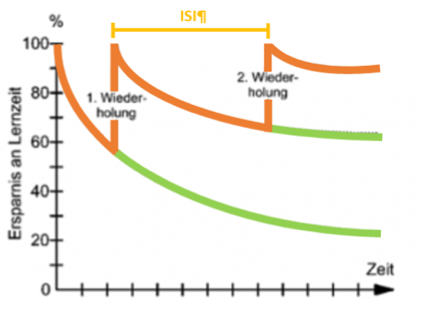

**Jeder kennt es: Es sind nur noch drei Tage bis zur Prüfung, man hat noch nicht wirklich gelernt, zieht zwei „all-nighter“ durch, schreibt völlig fertig die Prüfung und... schafft sie dann doch irgendwie. Was genau ist aber das Problem mit diesem Phänomen und welche Vorteile hat dieses verteilte Lernen, von dem alle immer sprechen? Die Lernpsychologie hat hierzu schon einige Erkenntnisse parat, auf die es sich lohnt, einen Blick zuwerfen.**

Beim verteilten Lernen tritt der sogenannte „Distributed Practice Effect“ auf. Zu beachten ist hierbei die Zeitspanne von der letzten Lernsitzung bis zum Test (Retentionsintervall). Ist das Retentionsintervall bis zum Test sehr klein, ist zwar das massierte Lernen von Vorteil, jedoch ist der Lernstoff nach dem Test schnell wieder vergessen und somit nicht nachhaltig und gerade für ein Studium ungeeignet. Ist das Intervall jedoch länger, ist das verteilte Lernen besonders effektiv. Zudem ist die Gestaltung der Lernsitzungen wichtig. Zusammenhängende Lerninhalte sollten blockweise in einer Lernsession gelernt werden. Zwischen zwei Lerneinheiten mit gleichem Inhalt sollte dabei eine Pause (Inter-Study-Intervall (ISI)) eingebaut werden.  

Diesen Effekt hat der Psychologe Hermann Ebbinghaus bereits 1880 nachgewiesen. In seinem Buch „Über das Gedächtnis“ schreibt er von einem seiner Experimente, in welchem er immer zur gleichen Tageszeit verschiedene Reihen sinnloser Silben (z.B. mök) bis zur fehlerfreien Wiedergabe gelernt hat. Diese Silben-Reihen wiederholte er einen Tag nach dem Lernen (ISI) und versuchte sie nach einem Retentionsintervall erneut aufzusagen. Die Ergebnisse zeigen, dass mehrfach Gelerntes zu einem späteren Zeitpunkt besser aufgesagt werden kann als einmal Gelerntes. Dies stellte er in der sogenannten Vergessenskurve grafisch dar (siehe Abb. 1). Hierbei steht die orangefarbene Kurve für die Vergessenskurve bis zur nächsten Wiederholung. Wie man sieht wird diese nach jedem ISI flacher, was zeigt, dass langsamer vergessen wird. Wiederholt man das Gelernte nicht, fällt die Kurve exponentiell weiter, was die grüne Kurve darstellt. Die ISIs sollten dabei mit der Zeit immer länger werden, da das Gelernte vertrauter wird.  

  

*Abbildung 1:* Effekt des verteilten Lernens auf die Vergessenskurve  
Quelle: In Anlehnung an: Stangl, W. (2020). Vergessen Gedächtnis Erinnern. 

Erklären lässt sich dieser Distributed Practice Effect durch das Two-Factor-Model, das zwei Erklärungsansätze liefert. Zum einen wird beim Wiederholen des Lernstoffs die Gedächtnisspur auf neuronaler Ebene verstärkt. Zum anderen ergeben sich durch längere ISIs auch neue Kontexte für die nächste Lernsession, die bei jedem Lernen mitgespeichert werden. Durch Verknüpfung der Inhalte mit unterschiedlichen Umweltreizen wird die Wahrscheinlichkeit, Inhalte wieder abzurufen, erhöht.

Wie du dir den Distributed Practice Effekt zu Nutze machen kannst:  

1.	Setze dir frühzeitig eine Deadline für deine letzte Lernsession.  

2.	Teile dir deinen Lernstoff in inhaltlich zusammenhängende Blöcke ein, wobei du in einer Lernsitzung jeweils nur einen Themenblock lernst.  

3.	Wiederhole oft und halte deine Lernsessions möglichst kurz.  

4.	Wechsle in deinen ISIs deine Umgebung, damit du mehr Eindrücke hast, mit welchen sich die Lerninhalte verknüpfen lassen (Bibliothek, Park, Mensa, etc.).  

Mit diesen Tipps gehören die „all-nighter“ vor der Prüfung nun der Vergangenheit an und als zusätzlichen Nebeneffekt weißt du Gelerntes auch noch nach der Klausur!

**Quellen:**  

- Stangl, W. (2020). Vergessen Gedächtnis Erinnern. [werner stangl]s arbeitsblätter.   https://arbeitsblaetter.stangl-taller.at/GEDAECHTNIS/Vergessen-Ebbinghaus.shtml  

- Ebbinghaus, Hermann. Über das Gedächtnis: Untersuchungen zur experimentellen Psychologie. Darmstadt: WBG (Wiss. Buchges.), 2011. Seiten: VIII-XVI und 52-79

